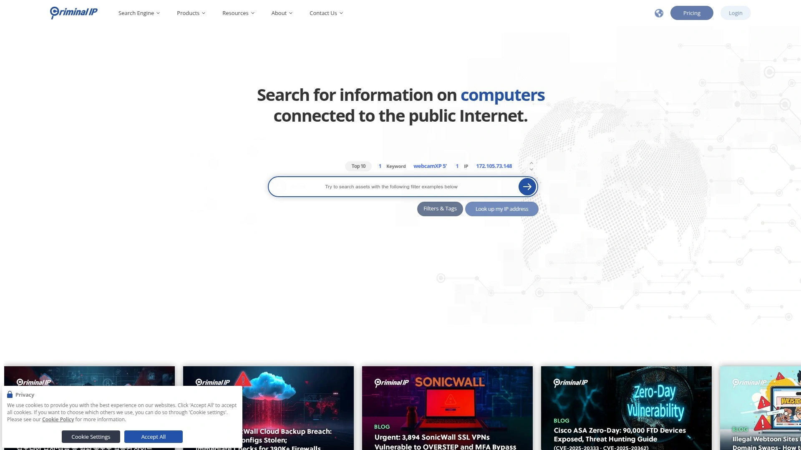

# Top 26 IP Geolocation and Proxy Detection Tools Ranked in 2025 (Latest Compilation)

Where your users connect from shapes everything—from the content they see to the security measures you deploy. Whether you're personalizing website experiences, enforcing geographic restrictions, detecting fraudulent activity, or simply analyzing traffic patterns, knowing the physical location and connection type behind an IP address has become essential infrastructure for modern web applications. The challenge isn't finding IP geolocation tools—it's finding ones that deliver accurate, up-to-date data without breaking your budget or slowing down your application. Some services excel at pinpointing city-level locations with postal code precision. Others specialize in unmasking VPNs, proxies, and other anonymizing technologies that fraudsters hide behind. The best tools combine both capabilities while offering flexible deployment options, whether you need a lightning-fast API, a downloadable database, or batch processing for millions of lookups.

This guide examines 26 specialized platforms that provide IP intelligence—from established industry leaders with decades of data refinement to innovative newcomers leveraging machine learning and proprietary probe networks. Each offers distinct advantages in accuracy, coverage, speed, pricing, and specialized features like threat intelligence integration or multi-language support.

## **[IP2Location](https://ip2location.com)**

Comprehensive IP intelligence platform combining geolocation precision with advanced proxy detection capabilities.

Since launching in 2002, IP2Location has evolved into one of the most comprehensive IP intelligence platforms available. The service stands out for its breadth—offering 38 distinct data sets that span from basic country identification down to precise city-level coordinates, ISP information, time zones, and weather station data. What makes this particularly valuable is the daily database refresh cycle, ensuring you're working with current information as IP blocks get reassigned and network topologies shift.

The platform handles both IPv4 and IPv6 addresses within unified databases, eliminating the need for separate lookups or dual implementations. Beyond basic geolocation, IP2Location includes robust proxy detection capabilities that identify residential proxies, various proxy types, and calculate fraud scores with threat level classifications. The service provides flexible integration options including downloadable databases for local queries, REST APIs for real-time lookups, and SDKs supporting Java, .NET, PHP, Ruby, Python, and Perl.

For businesses requiring offline processing or handling sensitive data that can't be sent to external APIs, the downloadable database option proves particularly useful. The packages scale from basic country-level data up to enterprise solutions with complete data sets. Free demo accounts include 200 daily IP lookups along with complimentary tool access, making it straightforward to evaluate accuracy against your specific use cases before committing to paid tiers.

## **[MaxMind GeoIP](https://www.maxmind.com)**

Industry-leading IP geolocation with two decades of database refinement and 99.9999% IP address coverage.

MaxMind essentially created the IP geolocation industry and remains the gold standard that other services benchmark against. With over 20 years of continuous database refinement, they've achieved 99.9999% coverage of active IP addresses—an extraordinary completeness that matters when dealing with edge cases or emerging network blocks. Their accuracy rates are independently verified: 99% at country level, 90-95% at region level, and 80-90% at city level, with premium web services pushing even higher.

The company offers two main product lines. The GeoIP2 databases are downloadable files updated regularly that you host locally, perfect for high-volume applications where per-query costs would be prohibitive and network latency matters. The web services provide slightly better accuracy (about 5% more exact matches at postal code level in the US) by querying MaxMind's current data without local caching delays. Web services use metered pricing where you pay per lookup, while databases use subscription models.

MaxMind also provides GeoLite2—a free but less accurate version suitable for non-commercial projects or initial development. The free tier requires account creation but imposes no usage limits. For enterprise needs, the GeoIP Enterprise database consolidates multiple data types with confidence factors and user type classifications (residential, cellular, business, government, etc.), enabling sophisticated risk assessment and traffic analysis. Big four accounting firms audit their methodologies annually, providing compliance documentation for regulated industries.

## **[IPinfo](https://ipinfo.io)**

High-quality IP data powered by a proprietary probe network delivering industry-leading accuracy.

IPinfo distinguishes itself through its proprietary probe network—a globally distributed infrastructure that actively measures and triangulates IP address locations rather than relying solely on registry data and third-party sources. This approach yields demonstrably higher accuracy, particularly for consumer IP addresses which tend to be the most challenging to geolocate precisely. The service returns rich data including city-level geolocation, ASN details, hosting provider identification, and essential privacy indicators like VPN and proxy detection.

The platform offers both API and downloadable database options, letting you choose between real-time lookups and local processing. The database format includes all standard geolocation fields plus critical context like connection type, company information, and privacy flags (VPN, proxy, Tor, hosting). Updates roll out daily, ensuring your local data stays current. The API infrastructure is built on Google Cloud and automatically scales to handle demand spikes without degradation.

IPinfo maintains official client libraries across numerous languages and platforms, with comprehensive documentation and code samples making integration straightforward. The Core plan provides city-level precision with privacy context, while higher tiers add company identification, domains hosted at each IP, and detailed ASN relationships. A standout feature is the generous free tier offering 50,000 monthly API requests, substantially more than most competitors and sufficient for small to medium applications. The service particularly excels at mobile IP geolocation, where many providers struggle with accuracy due to carrier gateway complexities.

## **[ipstack](https://ipstack.com)**

Globally distributed API infrastructure behind Cloudflare delivering consistent sub-50ms response times.

Built on Cloudflare's edge network, ipstack prioritizes speed and scalability above all else. The service achieves real response times under 50 milliseconds in most global regions by serving requests from the nearest edge location. This infrastructure proves invaluable for user-facing applications where geolocation happens in the request path and latency directly impacts experience. The API supports both single IP lookups and bulk operations, with the bulk endpoint accepting up to hundreds of addresses in one call.

Data coverage is comprehensive, spanning location information (country, region, city, postal code, coordinates), currency details, time zones, and connection metadata like ISP and organization. Different pricing tiers unlock additional modules: the security module adds threat detection and proxy identification, while premium tiers provide access to the bulk endpoint for efficient batch processing. The API accepts both JSON and XML output formats with field filtering to reduce payload size when you only need specific attributes.

Documentation is thorough and includes all required parameters, optional fields, and error handling patterns. While official libraries aren't provided, the straightforward REST interface works seamlessly with any HTTP client. The free tier permits non-commercial use but lacks SSL encryption—paid tiers add HTTPS for secure transmission. Rate limiting on the free plan caps at around 100 requests per month. For production deployments, paid plans start at $9.99 monthly with SSL protection and reasonable query volumes. The service particularly appeals to developers who need reliable, fast geolocation without implementing their own global infrastructure.

## **[IPGeolocation.io](https://ipgeolocation.io)**

Generous 30,000 free monthly requests with unique supplementary APIs for astronomy and timezone data.

IPGeolocation.io positions itself as having the best free tier in the industry, offering 30,000 requests monthly without charge—substantially more than most competitors. This makes it viable for small production applications or larger development efforts without immediate budget. The service provides standard geolocation data including country, region, city, latitude, longitude, postal code, and currency information, alongside security insights like proxy detection and VPN identification.

What differentiates this service is the suite of complementary APIs included at no extra charge. The Astronomy API returns sunrise, sunset, moonrise, and moonset times for any location—useful for applications in photography, outdoor activities, or astronomy. The Timezone API provides detailed timezone information and conversion capabilities. A User-Agent API parses browser strings to extract device and browser details. These auxiliary services are accessible across all pricing tiers including the free plan.

The infrastructure runs on Cloudflare's global network with geoDNS routing requests to the nearest node, combining speed with DDoS protection. The company claims an average response time around 40 milliseconds with 99.99% uptime SLA on paid plans. Data updates happen multiple times weekly to maintain accuracy. Multilingual responses support English, Spanish, German, Russian, Japanese, French, Chinese, Czech, Italian, Korean, Persian, and Portuguese.

Official libraries exist for Java, C#, PHP, TypeScript, JavaScript, and jQuery, with clear code samples accelerating integration. The Bronze paid tier ($15/month) includes 150,000 requests but limits some data points—full API access requires the $65/month tier. For applications needing the unusual combination of geolocation, astronomical calculations, and timezone handling, this bundled approach simplifies architecture.

## **[IP2Proxy](https://ip2proxy.com)**

Specialized detection engine identifying VPNs, proxies, Tor nodes, and residential proxies with threat scoring.

IP2Proxy focuses exclusively on proxy detection rather than trying to be a general-purpose geolocation service, allowing deep specialization in anonymizer identification. The platform detects an extensive range of proxy types: VPN servers, public proxies, web proxies, Tor exit nodes, data center ranges, and critically, residential proxies—which are notoriously difficult to identify because they route through legitimate ISP IP addresses assigned to homes. Residential proxy detection matters for fraud prevention as these services explicitly market themselves as "undetectable" to businesses.

Each detected proxy receives a threat level classification and fraud score based on historical abuse patterns and current intelligence. The service returns additional context like proxy type, when the IP was last seen operating as a proxy, and the confidence level of the detection. This risk scoring enables graduated response strategies—perhaps blocking high-risk IPs entirely while adding extra verification steps for moderate risks rather than blanket blocking all detected proxies.

Deployment options include downloadable databases for local lookups, a REST API for real-time checks, and a batch processing service where you upload IP lists and receive bulk results. The local database approach suits applications processing large volumes where per-query API costs would be prohibitive, while the API works better for real-time scoring during user registration or transaction processing.

IP2Proxy integrates with various platforms through pre-built widgets, provides bulk lookup through web upload, and connects with automation platforms like Zapier for workflow integration. The service maintains separate databases for IPv4 and IPv6, with regular updates to catch newly identified proxy infrastructure. For businesses combating account fraud, scraping, bonus abuse, or geographic restriction bypass, this focused solution often outperforms generic geolocation services with basic proxy flags.

## **[IPQS (IPQualityScore)](https://www.ipqualityscore.com)**

Advanced fraud prevention platform claiming 40% better detection rates with minimal false positives.

IPQualityScore positions itself as the most accurate proxy and fraud detection service available, claiming 40% higher detection rates compared to competitors while maintaining extremely low false-positive rates. This combination matters critically—aggressive blocking stops fraud but also frustrates legitimate users, while conservative settings let threats through. IPQS threads this needle through proprietary honeypots, extensive blacklists, forensic analysis techniques, and customer feedback loops that continuously refine the detection models.

The service assigns comprehensive IP reputation scores ranging from 0-100 considering multiple factors: recent attack history, proxy detection, VPN usage, connection type, hosting provider identification, and presence across various threat feeds. Organizations can customize scoring thresholds and rules to match their specific risk tolerance—perhaps allowing VPNs for low-value interactions while blocking them for financial transactions. The platform detects not just standard proxies but compromised servers, hosting providers suspected as VPN sources, and known VPN service infrastructure.

Beyond the IP address itself, IPQS can incorporate additional signals like device fingerprinting, email validation, phone number intelligence, and transaction details to build a complete risk profile. This multi-factor approach substantially improves accuracy over IP-only checks. The system provides over 25 data points per lookup including threat type classifications, recent attack counts, and risk scoring breakdowns.

Free accounts receive 1,000 monthly lookups with additional queries being very cost-effective. One-click plugins exist for major ecommerce platforms, CMS systems, SOAR tools, and firewalls to streamline deployment. The company emphasizes customer support and configuration assistance to ensure the system adapts to each organization's specific traffic patterns and fraud landscape, reducing the operational overhead of tuning detection rules.

## **[DB-IP](https://db-ip.com)**

Extensive geolocation database covering 2 million unique locations across 215,000+ cities worldwide.

DB-IP provides exceptional geographic granularity with location data for over 2 million unique points spanning more than 215,000 cities globally. This dense coverage proves particularly valuable when dealing with less common IP addresses or regions where other providers might fall back to country or region-level accuracy. The database interoperates with Geonames, the widely-used open geographic database, making integration with existing mapping and location systems straightforward.

A standout feature is comprehensive multilingual support—location names are available in over 50 languages, allowing applications to display familiar place names to international users. If your Ukrainian user's IP resolves to Київ rather than Kiev, that local familiarity improves experience. The service also handles real-time currency conversions for 50+ currencies, useful for e-commerce applications personalizing pricing displays.

The commercial databases carry a Creative Commons BY 4.0 license, allowing broad usage including commercial applications with attribution. Pricing follows a monthly subscription model with tier differences primarily in geographic detail (country vs. city) rather than request volumes. DB-IP also offers free Lite databases updated monthly with reduced accuracy compared to the commercial versions, suitable for development or non-critical applications.

Integration happens through downloadable CSV or MMDB format databases that you query locally, eliminating per-lookup costs and API dependencies. The MMDB format specifically works with MaxMind's reader libraries, providing a drop-in replacement option if you're already using that format. API access is available through the dashboard for real-time lookups with usage monitoring and alerting when approaching quota limits.

## **[BigDataCloud](https://www.bigdatacloud.com)**

Lightning-fast API with patented geolocation technology achieving sub-millisecond response times.

BigDataCloud leverages patented, proprietary algorithms to achieve exceptional speed—sub-millisecond response times for IP lookups, which matters tremendously for user-facing applications where geolocation happens in the request path. The company combines multiple data sources and applies sophisticated processing to resolve IP locations with higher accuracy than approaches relying solely on registry data. They publish an industry-first daily accuracy report showing current performance metrics, demonstrating unusual transparency.

The service provides comprehensive location details including city, region, country, postal code, coordinates, and administrative boundaries. Notably, it supports FIPS codes for uniquely identifying geographic areas within the United States—a requirement for many government and regulated applications. Additional data includes network information, ASN details, timezone, currency, and localized metrics across 147 languages. Security features detect VPNs, proxies, bots, hosting environments, and blacklisted IP blocks.

Infrastructure reliability is backed by a 99.999% uptime SLA—among the highest in the industry—with globally distributed servers using geolocation routing to direct requests to the nearest endpoint. This GeoDNS approach combined with the core speed optimization results in consistent low-latency responses regardless of user location. The platform scales to billions of queries daily without degradation.

Both REST and GraphQL APIs are available, with GraphQL offering more efficient data retrieval by letting you specify exactly which fields to return in a single request. This reduces bandwidth and parsing overhead. The generous free tier permits substantial usage for testing and smaller applications, while paid tiers remain competitively priced considering the performance and accuracy delivered.

## **[Abstract API](https://www.abstractapi.com)**

Developer-friendly geolocation covering 4 billion+ IP addresses with straightforward implementation.

Abstract API emphasizes ease of integration and developer experience, providing clean documentation, abundant code examples, and official libraries across multiple languages. The service maintains geolocation data for over 4 billion IP addresses covering both IPv4 and IPv6 spaces. Response data includes standard fields like country, region, city, postal code, coordinates, timezone, and currency information, along with VPN detection flags for identifying anonymous connections.

The API uses a simple GET request pattern requiring only an API key and IP address, with responses returned in JSON format. Field names are descriptive and consistent, making response parsing straightforward. The connection information section identifies the ISP, organization, autonomous system number, and connection type (dialup, cable/DSL, cellular, corporate). Security flags indicate whether the IP is associated with VPN or proxy usage.

Official client libraries exist for JavaScript, Python, PHP, Ruby, Go, and .NET, with both synchronous and asynchronous usage patterns documented. The JavaScript library is available via npm or direct CDN inclusion for browser usage. Each library includes detailed examples covering common use cases like form auto-filling, content personalization, and fraud screening.

Pricing starts with a free tier suitable for development and small applications, with paid tiers scaling based on monthly request volume. The company also offers bundled plans combining IP geolocation with other useful APIs like email validation, phone number verification, and holiday lookups—convenient for applications needing multiple verification services. Abstract focuses on the developer experience around implementation and integration rather than exotic features, making it ideal for teams that value simplicity and clear documentation.

## **[IPLocate.io](https://iplocate.io)**

High-accuracy alternative achieving 100% location coverage with verified 90%+ US city-level precision.

IPLocate.io prioritizes accuracy above all else, investing heavily in data quality and regularly publishing testing results. Their internal benchmarks show 100% coverage of all allocated and routable IP addresses, with verified 99%+ country-level accuracy and over 90% US city-level accuracy within 20km—comparing favorably against major paid competitors. Testing methodology uses IP addresses from known locations to validate precision, focusing particularly on consumer addresses which are typically hardest to geolocate accurately.

The service processes over 5 terabytes of data daily, combining trusted open data sources with proprietary global network measurements. This hybrid approach helps identify IP locations more precisely than pure registry data analysis. Updates can be scheduled according to your needs and budget, from daily refreshes for critical applications down to weekly or monthly for less time-sensitive uses.

Deployment options include both API access and downloadable databases. The database offering provides complete coverage in MMDB format compatible with MaxMind's reader libraries, making it a potential replacement for applications already using that format. The country-level database is free forever with daily updates. The full city-level database includes country, city, region, postal code, timezone, currency, and satellite/anycast indicators.

The company claims more than 100,000 teams use their services, spanning from solo developers to enterprise applications. Use cases include content personalization, fraud detection, analytics enrichment, and ad targeting. For businesses prioritizing accuracy and willing to pay slightly more for demonstrably better location data, particularly within the United States, IPLocate.io presents a compelling option backed by transparent testing methodology.

## **[Proxycheck.io](https://proxycheck.io)**

Comprehensive proxy detection with granular risk scoring and detailed attack history tracking.

Proxycheck.io specializes in identifying and assessing the risk level of proxy connections, VPNs, and anonymous access methods. The service provides highly granular control through numerous API flags that let you tune detection behavior: separate controls for VPN checking, ASN lookup, risk scoring, port detection, and time tracking. You can configure whether to detect proxies only, VPNs only, or both, with results reflecting your specific security requirements.

Risk scoring is particularly sophisticated. Basic scores range from 0-100 indicating overall threat level, with scores under 33 considered low risk, 34-66 high risk, and above 66 very dangerous. When you enable detailed risk assessment, you receive individual attack counts by type: login attempts, registration attempts, comment spam, denial of service, forum spam, form submissions, and vulnerability probing. This historical attack data helps distinguish between legitimate VPN users and IPs with documented malicious behavior.

The API returns extensive data including geolocation (country, region, city, postal code, coordinates), currency information, ISP details, ASN data, connection type classification, and whether the IP is associated with cloud services, hosting providers, mobile networks, or scanner activity. You can also retrieve the specific port number where proxy services were observed and when the IP was last seen operating as a proxy.

Customization extends to the output format itself—results can be returned in pretty-printed JSON for human readability or compressed single-line format for machine parsing. The tagging system allows you to annotate queries for later analysis. Free accounts receive 1,000 daily checks with various API flags available. The service updates in real-time as new proxy infrastructure is detected across their monitoring network.

## **[ipdata](https://ipdata.co)**

Global infrastructure across 11 AWS regions delivering 60ms average response with 100+ threat feeds.

ipdata operates from 11 AWS data centers distributed globally, ensuring low latency regardless of where requests originate. The infrastructure averages 60-millisecond response times without caching or CDN acceleration, making it suitable for real-time applications. The service is trusted by major corporations including NASA, AMD, Ring, Red Hat, Accenture, McKinsey, and Stanford, handling tens of billions of requests.

Beyond standard geolocation data (continent, country, region, city, postal code, coordinates), ipdata provides extensive supplementary information: ISP and company identification, carrier details for mobile IPs, timezone data, currency information with symbols, calling codes, flag images, and language data. The threat intelligence component is particularly comprehensive, instantly checking IPs against over 100 OSINT threat feeds to identify known malicious actors. Machine learning-generated reputation scores provide advanced threat detection beyond simple blacklist matching.

The service detects anonymous users through VPN and proxy identification, helping protect against fraud and abuse. Connection type classification distinguishes between ISP, datacenter, and business networks. For e-commerce specifically, the platform helps prevent chargebacks and fake account signups by identifying high-risk connection patterns. GDPR and CCPA compliance features assist with regulatory requirements around geographic data handling.

Integration is straightforward with official libraries for C#, Python, JavaScript, Go, PHP, and Java, all thoroughly documented. A useful bulk endpoint accepts multiple IP addresses in one request, efficiently utilizing your daily quota. The free tier permits testing and non-commercial use, while paid plans start at $10 monthly for 2,500 daily requests with full data access across all pricing levels—no artificial feature restrictions on lower tiers.

## **[Ipregistry](https://ipregistry.co)**

Complete IP intelligence platform integrating 220+ OSINT threat feeds with user-agent parsing.

Ipregistry provides remarkably comprehensive IP intelligence by combining geolocation data with extensive threat detection and contextual information. The threat intelligence component queries over 220 OSINT feeds to identify IPs flagged for malicious activity including hosting nodes, Tor connections, public proxies, and addresses marked as abusers across the cybersecurity community. This broad threat visibility helps identify emerging threats that might not yet appear in more focused blacklists.

Standard geolocation coverage includes all expected fields down to postal code, coordinates, timezone, and currency details. The company and carrier information helps identify corporate vs. residential connections. A unique feature is built-in user-agent parsing—submit a user-agent string along with the IP and receive detailed browser, device, and operating system information. This combined analysis streamlines multi-factor risk assessment without requiring separate services.

The API supports bulk lookups returning data for multiple IPs in one request, optimizing efficiency. Response times are competitive globally due to distributed infrastructure. Data accuracy is a stated priority, with the company accepting correction submissions from trusted sources and publishing guidance on providing geofeeds for organizations managing IP blocks. This feedback mechanism helps continuously improve data quality.

Official client libraries are maintained for Java, JavaScript/TypeScript, Python, Ruby, and PHP, with comprehensive documentation and examples. Pricing is transparent with various tiers based on monthly lookup volume. The service particularly appeals to applications needing the combination of geolocation, threat intelligence, and user-agent analysis since bundling these eliminates the complexity of integrating multiple specialized services.

## **[IP-API](https://ip-api.com)**

Simple reliable free service operating since 2012 with no registration required for non-commercial use.

IP-API embodies simplicity and accessibility. The service has operated since 2012 providing reliable IP geolocation without requiring API keys or user registration for basic usage. You simply make a GET request to their endpoint and receive JSON or XML response with comprehensive location data: continent, country, region, city, district, postal code, coordinates, timezone, currency, ISP, organization, and ASN information. Mobile, proxy, and hosting flags help identify connection types.

The free endpoint permits non-commercial use with rate limiting of 45 requests per minute from a single IP address. This limitation is reasonable for development, testing, and smaller applications. If usage exceeds the limit, requests receive HTTP 429 throttle responses until the rate window resets. The infrastructure is built on dedicated servers across US, EU, and APAC regions using Anycast routing to direct requests to the closest location, achieving sub-50ms average response times globally.

For commercial deployment or higher volumes, pro tiers add SSL encryption (the free endpoint uses HTTP only), unlimited query rates, usage statistics dashboards, and dedicated support. The pro service maintains the same simple interface and data structure, requiring only authentication credentials. Database updates happen continuously rather than on fixed schedules, ensuring you always receive the most current data without managing local database refreshes.

The lack of required registration for the free tier removes friction for rapid prototyping and evaluation. The API schema is stable and will not change, providing long-term reliability for applications built against it. While the free tier's HTTP-only transport is unsuitable for production applications handling sensitive data, the paid tiers add security without complexity.

## **[VPNAPI.io](https://vpnapi.io)**

Specialized VPN detection service partnering with ISPs and carriers for up-to-date identification.

VPNAPI.io focuses exclusively on VPN and proxy detection, building partnerships with ISPs, hosting providers, and mobile carriers to maintain current data on VPN infrastructure. These direct relationships provide visibility into network changes and new VPN services that might not yet appear in crowd-sourced databases. The service aggregates and cross-references multiple data sources to quickly classify whether an IP address belongs to a VPN server.

Classification happens in milliseconds by querying extensive network datasets. Beyond simple yes/no VPN detection, the service identifies specific usage patterns helpful for understanding risk context. The JSON output format integrates easily with modern programming languages including PHP, JavaScript, C++, and Python. Implementation typically takes minutes rather than hours due to the straightforward API design.

Use cases span spam prevention, fraud detection, geo-restriction enforcement, and strengthening KYC (know your customer) processes. Having VPN detection as a safeguard helps deter adversaries who rely on IP anonymization to evade bans or abuse systems. Free accounts receive 1,000 VPN checks before a paid plan is required—sufficient for small businesses or web administrators needing occasional checks.

The service is explicitly designed for quick lookups to determine if an IP is a VPN without additional complexity. This focused approach works well for applications where VPN detection is the primary concern rather than comprehensive IP intelligence. For businesses combating account sharing, bonus abuse, or geographic bypass, the specialized nature and carrier partnerships often provide better detection than general-purpose geolocation services with basic VPN flags.

## **[Criminal IP](https://www.criminalip.io)**

OSINT-based threat intelligence platform monitoring dark web activity and C2 servers.

Criminal IP operates as a comprehensive cyber threat intelligence platform rather than just an IP lookup service. The OSINT-based engine provides insights into IP addresses, domains, IoT devices, command and control servers, CVE vulnerabilities, and exploits. This breadth makes it valuable for security teams conducting investigations or threat hunting rather than simply scoring individual IPs.

The platform includes dark web monitoring, tracking threats emerging from underground forums and hidden services. This early warning capability helps identify attack infrastructure before campaigns launch. C2 server detection identifies command and control nodes used to manage botnets and malware infections. The vulnerability database connects IPs to known exploits and security weaknesses, helping prioritize patching efforts.

Risk scoring provides granular classification: Critical, Dangerous, Moderate, and Low scores with detailed breakdowns of why an IP received its score. The system tracks whether IPs are associated with scanners, hosting services, cloud providers, mobile networks, proxies, Tor, or VPNs. For security operations centers, this contextual intelligence helps triage alerts and focus on genuine threats rather than false positives from VPN users or cloud services.

Integration options include a Chrome extension providing AI-based phishing link checking, protecting users from malicious websites. The platform can enrich security tool outputs (SIEM, SOAR, XDR) with threat intelligence context, automating alert prioritization and incident response. Daily threat feeds are available for organizations wanting to ingest C2 indicators into their own systems. For enterprises requiring comprehensive threat intelligence rather than basic IP geolocation, Criminal IP delivers depth and context beyond typical geolocation providers.

## **[Spur](https://spur.us)**

Cutting-edge detection specializing in residential proxies and sophisticated bot identification.

Spur positions itself at the forefront of anonymizer detection, specifically targeting residential proxies and advanced bots that evade traditional detection methods. Residential proxies route traffic through real consumer IP addresses assigned by ISPs to homes, making them extremely difficult to identify since they appear identical to legitimate users. These services explicitly market themselves as "undetectable" to fraud prevention systems, making them popular with fraudsters and account abusers.

Spur's detection engine combines multiple techniques to identify these sophisticated evasion methods. The platform stays current with the latest anonymization technologies as they emerge, continuously adapting detection models. Beyond proxies, the bot detection component identifies automated traffic from scrapers, credential stuffers, and other malicious automation that increasingly mimics human behavior patterns.

The service provides real-time threat intelligence updates, ensuring protection against newly identified proxy infrastructure and bot patterns. This immediacy matters when dealing with organized fraud operations that rapidly rotate infrastructure after being detected. The platform is designed for businesses facing sophisticated threats where basic proxy detection proves insufficient.

Use cases include protecting e-commerce platforms from fraud, preventing account takeovers, stopping scraping operations, and enforcing authentic user requirements. Financial institutions, ticketing platforms, and limited-release retail sites benefit particularly from residential proxy detection since these sectors face determined adversaries using premium evasion tools. For organizations experiencing losses despite implementing standard fraud prevention, Spur's specialized detection often catches threats that slip through general-purpose tools.

## **[Fraudlogix](https://www.fraudlogix.com)**

Comprehensive fraud prevention platform combining proxy detection with bot identification.

Fraudlogix provides a unified fraud prevention solution integrating proxy detection, VPN identification, and bot traffic classification. The platform supports both IPv4 and IPv6 addresses with real-time detection capabilities. The IP Risk Score weighs multiple factors to assess whether an address represents a fraud risk, going beyond simple proxy detection to evaluate historical behavior patterns and threat intelligence.

The service delivers results in JSON format for easy integration with existing systems. DDoS protection is included, ensuring the fraud prevention system itself remains available during attack conditions. This resilience proves critical since fraudsters sometimes attempt to disable security checks before attacking primary systems.

Beyond individual IP lookups, the platform offers bulk processing for analyzing large IP lists or log files. This batch capability suits retrospective analysis of traffic patterns or preparing block lists. The Bot & Fraud API component classifies automated traffic, distinguishing between legitimate bots (search engines, monitoring services) and malicious automation (scrapers, spam bots, credential stuffing).

Fraudlogix markets primarily to ad tech companies, publishers, and performance marketers combating advertising fraud where bots generate fake impressions and clicks. The platform also serves e-commerce, lead generation, and SaaS businesses facing account fraud. The focus on advertising fraud detection provides specialized capabilities around impression validation and click quality that generic fraud tools often lack. For businesses in ad-heavy verticals or facing bot-driven fraud specifically, this domain expertise makes Fraudlogix worth evaluating.

## **[IPHub](https://iphub.info)**

Simple proxy detection interface operating since 2013 with straightforward fraud prevention.

IPHub offers an uncomplicated approach to proxy and VPN detection with a lookup interface featuring both web-based checks and API access. The service has operated since 2013, providing stability and consistent data quality. The free API tier makes it accessible for smaller applications or development projects that can't justify more expensive enterprise solutions.

Detection covers proxies, VPNs, Tor connections, and other anonymizing services commonly used to hide true IP origins. Results indicate whether an IP is flagged as a proxy and provide basic confidence scoring. The straightforward output works well for binary allow/block decisions without the complexity of multi-factor risk scoring.

Use cases focus on malicious IP detection, fraud prevention, and country blocking for geographically restricted content. Online stores integrate IPHub to reduce fraudulent orders from anonymous connections. Forums and social platforms use it to prevent ban evasion and duplicate account creation. Gaming services implement it to enforce one-account-per-user policies.

The simple API design means integration typically requires minimal development effort—make a GET request with an IP address and handle the yes/no proxy determination. This simplicity appeals to smaller organizations or solo developers who need basic protection without investing significant time in integration and configuration. The service's longevity demonstrates sustained operation, reducing concern about dependency on a service that might disappear.

## **[FraudLabs Pro](https://www.fraudlabspro.com)**

Multi-layer anonymous connection detection covering VPN, Tor, public proxies, and web proxies.

FraudLabs Pro approaches anonymous connection detection through a layered methodology identifying multiple proxy types. The service distinguishes between VPN connections, Tor exit nodes, public proxy servers, and web proxies—each representing different anonymization approaches with varying implications for fraud risk. This granular classification enables more sophisticated response policies than simple binary proxy detection.

VPN usage might indicate legitimate privacy concerns or corporate network access, warranting different handling than Tor connections which suggest deliberate high-level anonymization. Public proxy detection catches users routing through open proxy servers, while web proxy identification flags browser-based anonymization. The multi-layer approach provides context for risk assessment rather than blanket categorization.

The service integrates into broader fraud prevention workflows rather than operating as a standalone IP check. FraudLabs Pro combines IP analysis with email validation, transaction velocity checks, billing address verification, and device fingerprinting to build complete fraud profiles. This holistic approach reduces false positives since legitimate VPN users might be approved based on other positive signals while anonymous proxies combined with suspicious email patterns trigger blocks.

Implementation happens through API integration with detailed documentation covering request parameters and response interpretation. The service provides rules engines for customizing fraud detection logic based on your specific requirements and risk tolerance. For e-commerce and payment processors facing transactional fraud, the combined approach of IP screening plus transaction analysis often performs better than separate point solutions.

## **[Neustar IP Intelligence](https://www.security.neustar)**

Enterprise-grade IP intelligence delivering postal code accuracy with Big Four audited methodologies.

Neustar IP Intelligence targets enterprise customers requiring the highest accuracy levels and compliance documentation. The service achieves postal code-level precision in many cases using proprietary data collection technologies and verification methodologies that are audited annually by Big Four accounting firms. This independent validation provides the compliance documentation that regulated industries (finance, healthcare, government) often require.

Data granularity goes beyond standard geolocation to include detailed connection metadata, user type classifications, and network topology information. The postal code accuracy proves particularly valuable for location-based pricing, regional compliance requirements, and fraud detection where city-level data is insufficient. Coverage is global but with emphasis on developed markets where accuracy requirements tend to be strictest.

Enterprise-level SLAs guarantee availability and response times, with dedicated customer success managers assisting with implementation and optimization. The service is priced for enterprise budgets rather than small businesses, reflecting the enhanced accuracy, support level, and compliance documentation provided. Integration happens through API access or database deployment depending on volume and architecture requirements.

Neustar emphasizes data accuracy over cost leadership, positioning itself for organizations where location data directly impacts business outcomes or regulatory compliance. Use cases include regulatory compliance, fraud prevention, location-based pricing, and content delivery optimization. Financial institutions preventing loan application fraud, insurance companies adjusting premiums by region, and media companies enforcing geographic licensing restrictions represent typical customers. For these high-stakes applications, the premium pricing is offset by reduced fraud losses and compliance risk.

## **[IPWhois.io](https://ipwhois.io)**

Neural network-powered geolocation with self-learning database delivering real-time updates.

IPWhois.io differentiates through its self-learning neural network that continuously updates the geolocation database based on observed patterns and new data. This machine learning approach helps the service adapt quickly to IP block reassignments and emerging network topologies without waiting for manual database updates. The real-time learning means you consistently receive current data reflecting the latest network changes.

The API is designed for ease of use with no registration required for basic access—simply call the endpoint and receive geolocation results. For production use, registered accounts receive higher rate limits and access to premium features. Geographic data includes standard location fields plus timezone, currency, and ISP information. The multilingual response capability supports English, Russian, German, Japanese, Chinese, French, Spanish, and Portuguese.

Infrastructure is globally distributed for speed and reliability, with GeoDNS routing directing requests to the nearest server. Response times average around 100 milliseconds globally. All data transmission uses 256-bit SSL encryption ensuring security of queries and responses. The free tier provides 10,000 monthly requests suitable for small applications or development environments.

The self-learning aspect means accuracy potentially improves over time as the neural network ingests more data points and refines its models. This contrasts with static database approaches requiring explicit manual updates. For applications where having the absolute latest geolocation data matters more than having extensively audited historical data, the neural network approach offers advantages. The trade-off is less documentation around accuracy methodology compared to providers publishing detailed testing results.

## **[Geocodio](https://www.geocod.io)**

Specialized geocoding converting addresses to coordinates with comprehensive US and Canada coverage.

Geocodio focuses specifically on forward and reverse geocoding rather than IP geolocation—converting street addresses to coordinates (forward) and coordinates to addresses (reverse). While different from IP-based location services, Geocodio proves valuable for applications needing to correlate IP location data with physical addresses or enrich coordinate data with address details.

The service excels at US and Canadian address processing with high accuracy. Reverse geocoding "snaps" submitted coordinates to the nearest matching address, typically within a 500-foot threshold. The accuracy type indicator (rooftop, nearest_street, nearest_place) helps you understand precision levels. Batch processing supports up to 10,000 coordinates at once, efficient for bulk address validation or enrichment operations.

Data enrichment capabilities go beyond basic geocoding to include congressional districts, census tract information, and timezone data. This supplementary information proves useful for applications in political campaigns, demographic analysis, or regulatory compliance where knowing precise geographic boundaries matters. The spreadsheet enrichment feature allows uploading CSV files with addresses or coordinates and receiving enriched results with all requested data appended.

Pricing starts with 2,500 free lookups daily, sufficient for many small applications. Official client libraries for Ruby, Python, PHP, JavaScript, and command-line usage simplify integration. The API documentation is thorough with extensive examples. For applications needing to convert IP geolocation coordinates into street addresses, or validate address data from user input, Geocodio provides specialized capabilities that general IP geolocation services don't offer. The US/Canada focus means accuracy is highest in these markets.

## **[ipify](https://www.ipify.org)**

Simplest possible approach to retrieving your public IP address with no bells and whistles.

ipify serves one purpose exceptionally well: returning your public IP address. The API is refreshingly simple—make a GET request and receive your IP in plain text, JSON, or JSONP format depending on your needs. No registration, no API keys, no complex parameters. The service handles both IPv4 and IPv6 addresses with separate endpoints for each or a combined endpoint that returns whichever address type your connection uses.

This simplicity made ipify remarkably popular, handling tens of billions of requests monthly at its peak. The service was created as a personal project but gained traction because retrieving your own public IP is a common requirement that shouldn't require authentication or complex setup. The lack of features is intentional—ipify does one thing and does it reliably at massive scale.

Common use cases include applications that need to know their public IP address for registration, configuration, or logging purposes. Dynamic IP users can run scripts checking their current IP and updating DNS records or notification systems when it changes. Network administrators use it for quick IP verification during troubleshooting. The JSONP support makes it accessible from client-side JavaScript despite cross-origin restrictions.

The service is free, has no rate limits on the public endpoint, and makes no attempt to monetize through premium tiers. Code examples exist for virtually every programming language and framework. For the specific task of "what is my public IP address," ipify remains the gold standard of simplicity. It doesn't provide geolocation, threat detection, or any intelligence about IPs—but that's not its purpose. For applications needing those capabilities, you'd use ipify to get the IP then pass it to a separate geolocation service.

## **[AbuseIPDB](https://www.abuseipdb.com)**

Community-powered IP reputation database enabling reporting and checking of abusive addresses.

AbuseIPDB operates as a collaborative platform where system administrators and webmasters report IP addresses involved in malicious activity. The community-driven model means threat intelligence comes from actual victims of attacks rather than honeypots or theoretical data. The database tracks various abuse types: DDoS attempts, spam, fraudulent orders, hacking attempts, phishing, spoofing, SQL injection, and other malicious behavior.

The Confidence of Abuse score ranges from 0-100, indicating how confident the system is, based on user reports, that an IP is malicious. This percentage weighting helps distinguish between addresses with a single isolated report versus those with numerous reports from multiple sources. The distinct reporter count and recent report timing provide additional context for risk assessment.

Free API access allows 1,000 daily requests for both checking IPs and reporting abusive addresses. Verified webmasters receive 3,000 daily requests while supporters get 5,000. These rate limits accommodate most small to medium applications. The check API returns comprehensive data including confidence score, number of reports, last report date, ISP information, usage type, domain name, country, and top 20 detailed reports with comments from submitters.

The reporting functionality allows you to contribute back to the community database when detecting attacks against your systems. Fail2Ban integration tutorials help automate reporting of repeated failed login attempts and similar patterns. Web interface access has no usage limitations for manual lookups. The bidirectional model—both consuming and contributing threat intelligence—strengthens the overall database quality as more participants join. For businesses wanting to benefit from shared threat intelligence without expensive commercial feeds, AbuseIPDB provides substantial value.

## Which IP geolocation service fits your needs?

The right choice among these 26 platforms depends entirely on your specific requirements. Need postal code accuracy for pricing decisions? MaxMind GeoIP or Neustar IP Intelligence deliver verified precision. Combating sophisticated fraud with residential proxies? Spur and IPQS specialize in detecting evasion techniques. Building a small application on a budget? IP-API, ipify, and IPGeolocation.io offer generous free tiers. Operating at enterprise scale with compliance requirements? BigDataCloud's 99.999% SLA and Neustar's audited methodology provide necessary guarantees.

For most applications requiring both geolocation and basic proxy detection, **IP2Location** provides comprehensive coverage with daily database updates, flexible integration options, and 38 data sets spanning location details through threat indicators. The platform's combination of accuracy, breadth, and deployment flexibility makes it suitable for scenarios ranging from content personalization to fraud prevention, whether you need real-time API lookups or local database queries for high-volume processing.

**What scenarios work best for IP2Location?** Traffic analysis requiring detailed ISP and connection type data. Fraud prevention needing proxy detection alongside geolocation context. Applications processing sensitive data that can't be sent to external APIs. Multi-market applications requiring currency, timezone, and elevation data. Development teams needing SDK support across Java, .NET, PHP, Ruby, Python, and Perl.
